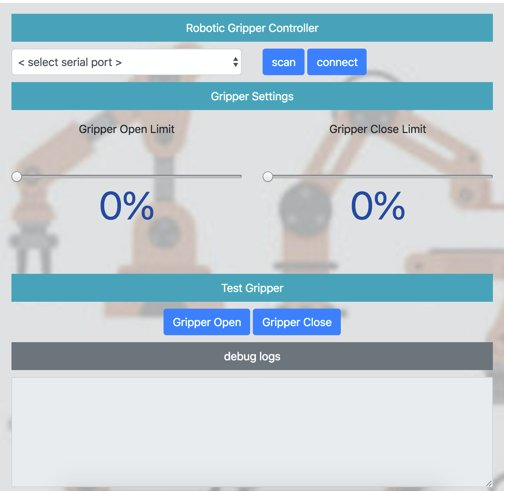

# Custom Robotic Gripper

This project provides a control system for a custom robotic gripper using serial communication. The gripper is powered by a brushless DC motor with a quadrature encoder and features a desktop user interface built with Electron.js.

---

## User Interface

The graphical interface is built with Electron.js for cross-platform desktop use.



## Features

- Electron.js-based GUI for desktop control
- Serial command interface for precise gripper control
- Encoder-based automatic limit detection
- Compatible with Teensy and Arduino boards
- Modular hardware design with a 3D printed gripper

---

## Hardware Requirements

- **Gripper**: 3D printed robotic gripper
- **Motor**: DC Motor [12V, 8.6 RPM]
- **Encoder**: Quadrature Encoder
- **Microcontrollers**:
  - Teensy 3.2
  - Arduino Uno / Mega

---

## Setup Instructions

### 1. Flash Firmware

First, flash the Teensy or Arduino with the firmware located in:


### 2. Install & Run GUI

Open a terminal and run the following commands:

```bash
cd <this_repo>
cd src.ui
chmod 777 install.sh
./install.sh         # If error occurs, try:
./install_on_error.sh
./run.sh

## Startup Behavior

On initialization, the gripper will:

1. Open until it reaches the physical open limit.
2. Close until it reaches the physical close limit.
3. Automatically compute open/close limits using encoder feedback.


## Serial Command Reference

| Command     | Format        | Description                                      |
|-------------|---------------|--------------------------------------------------|
| `o`         | `o`           | Fully open the gripper                           |
| `c`         | `c`           | Fully close the gripper                          |
| `ap<xxx>`   | `ap100`       | Actuate gripper to `<xxx>` percent (e.g., 100%)  |
| `OL<xxx>`   | `OL3000`      | Set open limit to value `<xxx>`                  |
| `CL<xxx>`   | `CL100`       | Set close limit to value `<xxx>`                 |
| `GO<xxx>`   | `GO5`         | Set gripper open factor to `<xxx>`              |
| `GC<xxx>`   | `GC5`         | Set gripper close factor to `<xxx>`             |


---

## Note

This project was developed as part of an evaluation prototype for a chocolate-picking robot gripper intended for use in an assembly line for a client in the UK. Due to confidentiality constraints, certain hardware images, detailed schematics, and implementation specifics are not included in this repository.


